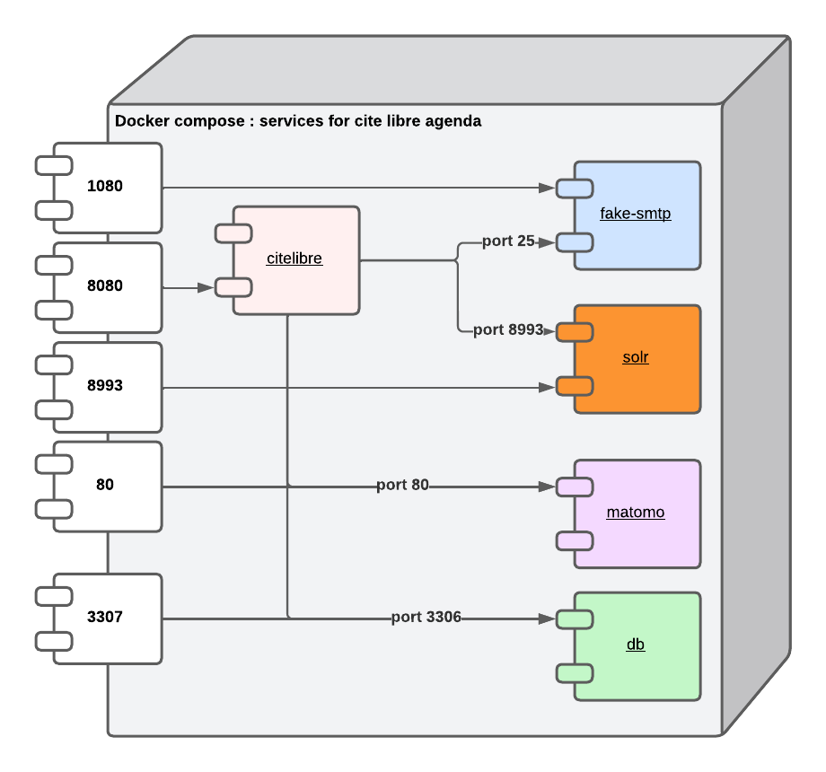

# CiteLibre Rendezvous with docker Compose

## Architecture


Architecture with embedded database and stmp server


## Environment variables

Create an `.env` file in the root directory where you should assign values for
environment variables containing sensitive data, such as external database connection information.
 These variables should be manually set. Here is a list of variables (key) that
need to be set in the `.env` file (key with = as separator):

 * LUTECE_DB_USER   : Set the user for the database connection
 * LUTECE_DB_PWD    : Set the password for the database connection
 * LUTECE_DB_NAME   : Set db name (schema) where your lutece tables are created
 * LUTECE_DB_HOST   : Set the mysql host where your database is hosted
 * LUTECE_DB_PORT   : Set the mysql port (if no set use by default 3306)
 * LUTECE_MAIL_HOST : Set the SMTP host
 * LUTECE_MAIL_PORT : Set the SMTP port
 * LUTECE_MAIL_USER : Set user authentification if your SMTP proivder required an authent
 * LUTECE_MAIL_PWD  : Set password authentification if your SMTP proivder required an authent


## Getting started

If you are behind a proxy :


1. Start the `CiteLibre` service (and any others) in background:

```bash
    docker-compose up -d
```

In interactive : 

```bash
    docker-compose up
```

Startup takes 1 minute

If you have created an env file named external-database.env start the following 

```bash
    docker-compose --env-file external-database.env up -d
```

If you create an `.env` file, docker compose use it without using --env-file 


1. Open UI at <http://localhost:8080/rendezvous>.

Back end is available at : <http://localhost:8080/rendezvous/jsp/admin/AdminLogin.jsp>

Defaut login is `admin` anbd password is `adminadmin`


1. Open UI mail (in order to see mail send by application) at <http://localhost:1080/>.


2. Open UI matomo (for see stats of your application) at <http://localhost:80>.

Defaut login is `admin` anbd password is `adminadmin`

### Helpful commands

- `docker-compose exec citelibre /bin/bash`: Get a bash shell inside your CiteLibre-rendezvous container.
- `docker-compose logs`: See all logs.
- `docker-compose logs {service}`: See logs for a particular service, e.g. `citelibre`.

## Optional services

If these services are not relevant to you, feel free to delete the corresponding commented sections.

## Persist your data (database and solr)

if you need to persist your data with an embedded database and solr you can use a local directory.
In docker-compose.yml uncomment the volumes section

For sample for the following volumes :
```
        volumes:
            - ./mysql-data:/var/lib/mysql
```

 Create the local directory mysql-data

 ```
    mkdir mysql-data
 ```

For solr uncomment 

```
        volumes:
            - ./solr-data:/var/solr/data/cite-libre/data
```
 Create the local directory solr-data

 ```
    mkdir solr-data
 ```


You can then launch docker compose 

```bash
    docker-compose up -d
```

in the local directory mysql-data and solr-data you will see some files and directory being created.


## Matomo

In matomo by default is displayed the day after today. Remember to change with the current date of the day if you want see the actual data

## External database
If you want to use an external database (only support mariabd or mysql for the moment),
create a database for lutece with the following command : 

```sql
    CREATE DATABASE citelibre
    CREATE USER 'admincitelibre'@'%' IDENTIFIED BY 'motdepasse'; 
    GRANT ALL PRIVILEGES ON *.* TO 'admincitelibre'@'%';
```


Load dump (dump.sql) to populate data with the following command :
```sql
    USE citelibre;
	SOURCE dump.sql;
```

**Important**
If the database is hosted on the same server, make sure you don't use *localhost* as it will use the container's localhost, instead use the IP address of the server.

To check that the database is accessible through the container network, open a terminal on the app container and type the following command ...
```bash
    Openssl s_client -connect <IP_or_host>:<PORT>
```

...the output should look like...
```bash
    CONNECTED(00000003)
    140278331168064:error:1408F10B:SSL routines:ssl3_get_record:wrong version number:../ssl/record/ssl3_record.c:331:
    ---
    no peer certificate available
    ---
    No client certificate CA names sent
    ---
    SSL handshake has read 5 bytes and written 283 bytes
    Verification: OK
    ---
    New, (NONE), Cipher is (NONE)
    Secure Renegotiation IS NOT supported
    Compression: NONE
    Expansion: NONE
    No ALPN negotiated
    Early data was not sent
    Verify return code: 0 (ok)
    ---
```

... or it will look like 
```bash
    140418660095296:error:0200206F:system library:connect:Connection refused:../crypto/bio/b_sock2.c:110:
    140418660095296:error:2008A067:BIO routines:BIO_connect:connect error:../crypto/bio/b_sock2.c:111:
    connect:errno=111
```

Create a database for matomo with the following command :

```sql
    CREATE DATABASE matomo
    CREATE USER 'adminmatomo'@'%' IDENTIFIED BY 'motdepasse'; 
    GRANT ALL PRIVILEGES ON *.* TO 'adminmatomo'@'%';
```

## Production usage

DO NOT use this without persisting your data and email. You should use
mounted volumes as containers can be recreated and re-init all data. 
